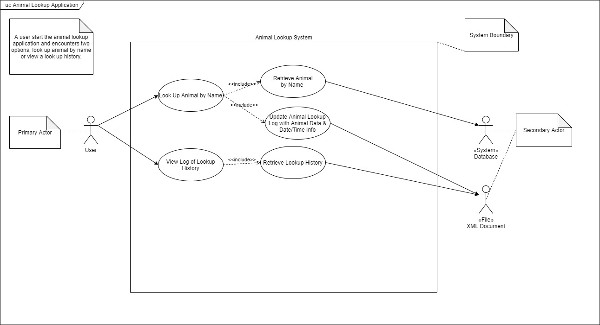
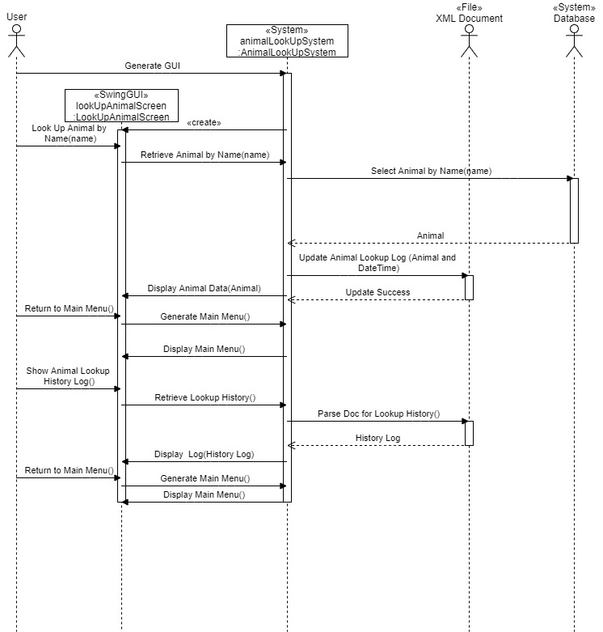
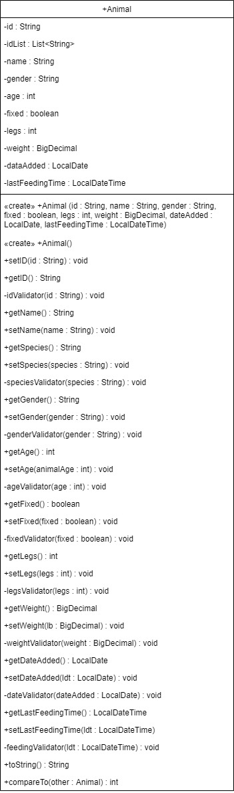

# Java II Final Project
## Short Description
> An application that allows a user to search for an animal by id or retrieve a lookup history from a Java Swing-based client. It is programmed to switch to four different languages via Internationalization. The client makes a request to retrieve all data associated with the animal from a separate distinct Server app listening for the user requests. The user can retrieve data from either MySQL or generate a log of lookup histories on all animals from an XML file depending on their choice. 

### Use Case Diagram

### Sequence Diagram

### Class Diagram

